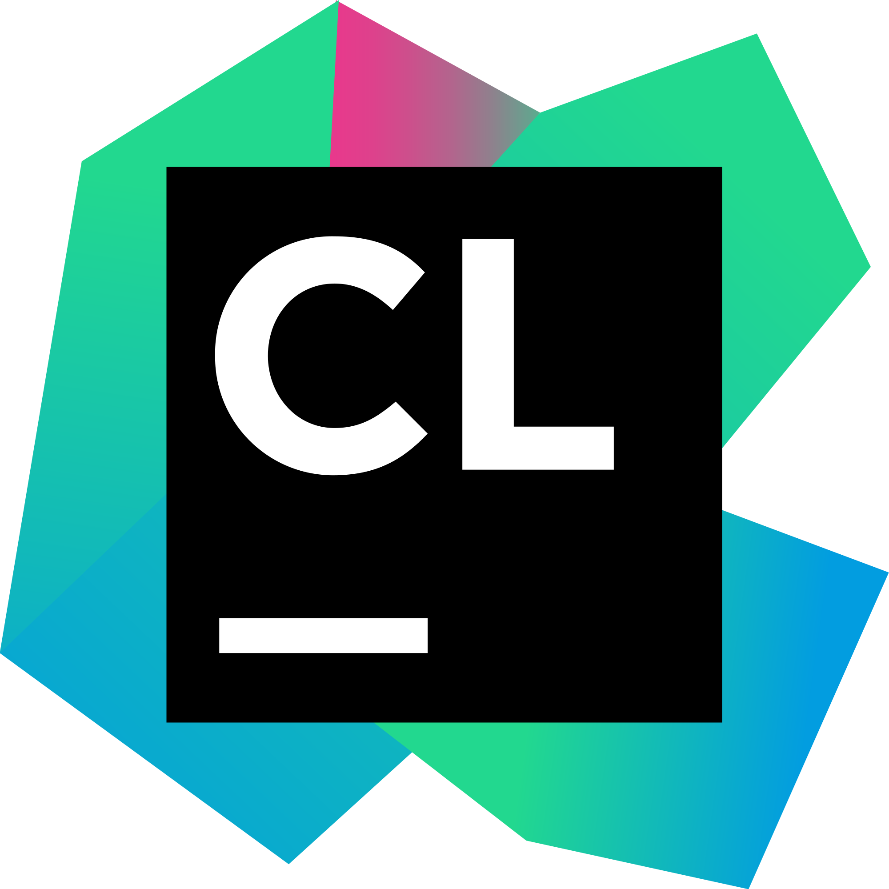
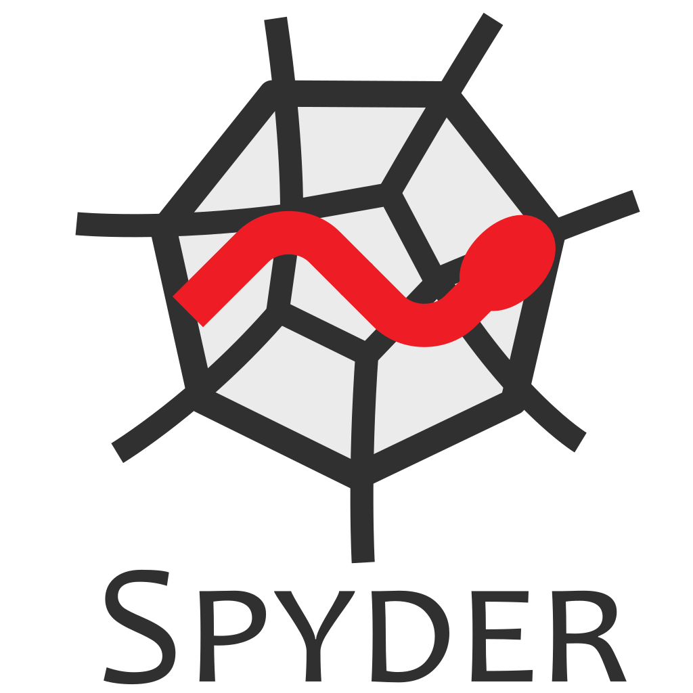
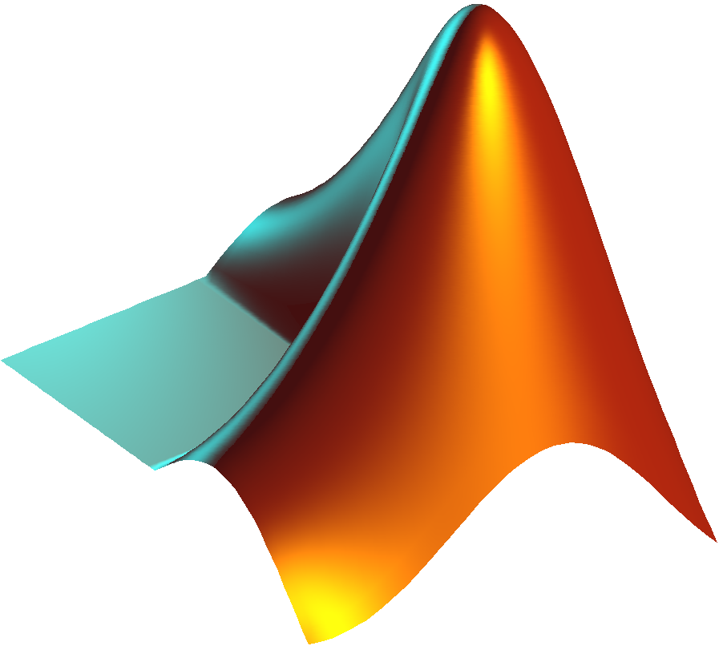

# Hello and Welcome!!! 

 My name is Niranjan. Nice to see you here!!! :smile: 

## About Me

- 🔭 I’m passionate about AI and Robotics

- 🌱 I’m currently studying reinforcement learning (RL) 

- 🔭 I’m currently working on some ML and DL projects

- 👯 I'm quite excited to work on AI for real-time robotics applications

- 💬 Talk to me about Robotics, AI, Python 

 
 

## 🔥 Languages:

 
    
      
    

 

## ⭐️ Libraries and Frameworks:

  
     
       
    
    
    
    
     
    

 
  
##  💥  Tools, IDEs and Softwares:

    
    
    
    
    
     
    
    

 
 

## GitHub's Activity Overview
  
| 

|  | 
| --- | --- |
|  |  |

 
 
 

<h2> Connect with me  </h2>
 

